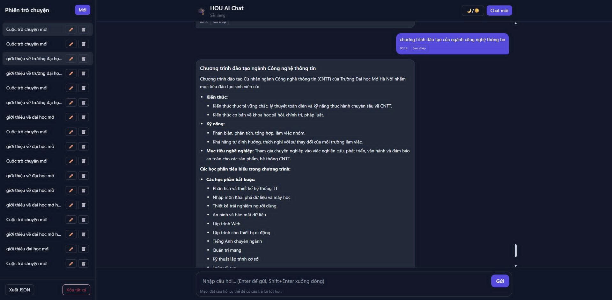

# 🤖 Chatbot AI Hỗ Trợ Tư Vấn Thông Tin Cho Sinh Viên

## 📌 Giới thiệu
Dự án **Chatbot AI Hỗ Trợ Tư Vấn Thông Tin Cho Sinh Viên** được xây dựng nhằm cung cấp một công cụ thông minh giúp sinh viên tra cứu nhanh chóng và chính xác các thông tin liên quan đến:
- Tuyển sinh
- Lộ trình học tập
- Các sự kiện, hội thảo, thông báo quan trọng
- Thông tin môn học, chương trình đào tạo

Chatbot được tích hợp các công nghệ **Xử lý ngôn ngữ tự nhiên (NLP)**, **Vector Search** và **Mô hình ngôn ngữ lớn (LLM)** kết hợp **RAG (Retrieval-Augmented Generation)** để hiểu ngữ cảnh câu hỏi và đưa ra câu trả lời phù hợp, không chỉ dựa vào từ khóa.

---

## 🎯 Mục tiêu và đối tượng sử dụng
- **Đối tượng**: Sinh viên đại học, đặc biệt là sinh viên mới, sinh viên muốn tìm hiểu chương trình đào tạo, đăng ký học phần, hoặc tra cứu thông tin tuyển sinh.
- **Mục tiêu**: Hỗ trợ sinh viên tra cứu thông tin một cách nhanh chóng, chính xác, và thân thiện thông qua giao diện chatbot AI tích hợp NLP.
- **Tăng cường trải nghiệm người dùng**: Cung cấp một công cụ tiện lợi, dễ sử dụng để sinh viên có thể tự tra cứu thông tin mà không cần phải tìm kiếm thủ công trên nhiều nguồn khác nhau.
- **Tiết kiệm thời gian**: Giúp sinh viên tiết kiệm thời gian trong việc tìm kiếm thông tin quan trọng liên quan đến học tập hoặc các thông tin khác.

---

## 🚀 Tính năng chính
- **Tra cứu thông tin tuyển sinh**: Ngành học, điểm chuẩn, mã ngành, tổ hợp môn, phương thức xét tuyển.
- **Hỗ trợ lộ trình học**: Thời gian đào tạo, tín chỉ, các môn học trong từng học kỳ.
- **Cập nhật sự kiện**: Hội thảo, ngày đăng ký học phần, thông báo từ nhà trường.
- **Thông tin môn học**: Mô tả, giảng viên, lịch học, tài liệu tham khảo.
- **Tương tác tự nhiên**: Trả lời câu hỏi theo cách tự nhiên, dễ hiểu.
- **Tìm kiếm thông minh**: Sử dụng vector embedding để tìm kiếm chính xác và nhanh chóng.
- **Hỗ trợ đa dạng câu hỏi**: Có thể trả lời các câu hỏi phức tạp (vd: dạng câu hỏi tổng hợp, so sánh), không chỉ dựa vào từ khóa.
- **Hiểu ngôn ngữ tự nhiên (NLP)**: Có thể trả lời câu hỏi dù cách diễn đạt khác với dữ liệu gốc.
- **Hỗ trợ đa ngôn ngữ**: (Có thể mở rộng sang tiếng Anh trong tương lai).
- **Tìm kiếm nhanh với FAISS**: Lưu trữ và truy xuất dữ liệu vector hiệu quả.
- **Tích hợp AI Gemini**: Mô hình LLM của Google để tăng khả năng suy luận và trả lời.

---

## 🛠️ Công nghệ sử dụng
- **[Python 3.10+]**: Ngôn ngữ lập trình chính.
- **[Flask]**: Xây dựng API và giao diện web cho chatbot.
- **[LangChain]**: Tổ chức pipeline xử lý dữ liệu và truy vấn.
- **[LangGraph]**: Quản lý luồng hội thoại và lưu bộ nhớ hội thoại.
- **[HuggingFace Embeddings]**: Tạo vector embedding từ dữ liệu và câu hỏi.
- **[FAISS]**: Lưu trữ và tìm kiếm vector embedding nhanh chóng.
- **[RAG (Retrieval-Augmented Generation)]**: Kết hợp tìm kiếm dữ liệu và sinh câu trả lời dựa trên ngữ cảnh.
- **[Chunking Data]**: Chia nhỏ tài liệu để tối ưu tìm kiếm và giới hạn context LLM.
- **[Google Generative AI (Gemini)]**: Sinh câu trả lời tự nhiên và mạch lạc.
- **[TailwindCSS]**: Tùy chỉnh giao diện web gọn nhẹ và responsive.
- **[BeautifulSoup / Selenium]**: Thu thập và làm sạch dữ liệu từ website.
- **[JSON/CSV]**: Lưu trữ dữ liệu đã chuẩn hóa, dễ dàng nạp vào hệ thống.

---

## 📂 Cấu trúc thư mục
```text
📦 CUOCTHIAI
│
├── chatbot/                          # Mã nguồn chính xử lý chatbot
│   ├── chat.html                     # Giao diện HTML đơn giản
│   ├── main.py                       # File khởi chạy chatbot
│   ├── query_chat.py                 # Xử lý truy vấn + pipeline truy xuất + LLM
│
├── data/hou/                         # Dữ liệu FAISS theo từng mục
│   ├── ctdt_index/                   # Chỉ mục chương trình đào tạo
│   │   ├── index.faiss
│   │   └── index.pkl
│   ├── diem_chuan_index/            # Chỉ mục điểm chuẩn
│   │   ├── index.faiss
│   │   └── index.pkl
│   └── hou_index/                   # Chỉ mục đại học mở
│       ├── index.faiss
│       └── index.pkl
│
├── hou/                              # Dữ liệu gốc được thu thập
│   ├── ChuongTrinhHoc/               # JSON chương trình đào tạo theo ngành
│   ├── DuLieuDiem/                   # JSON điểm chuẩn 
│   └── hou_crawler/                  # JSON website HOU
│
├── requirements.txt                   # Danh sách thư viện Python cần cài
├── README.md                          # Tài liệu mô tả project
└── video_demo.mp4                     # Demo sử dụng chatbot

```
## 🔧 Cài đặt
1. **Cài đặt Python 3.10+**: Đảm bảo bạn đã cài đặt Python phiên bản 3.10 trở lên.

2. **Cài đặt các thư viện cần thiết**:
   ```bash
   pip install -r requirements.txt
   ```

3. **Chạy ứng dụng**:
   ```bash
    python chatbot/main.py
    ```

4. **Truy cập giao diện**: Mở trình duyệt và truy cập `http://localhost:5000/chat`.

5. **Tương tác với chatbot**: Nhập câu hỏi và nhận câu trả lời từ chatbot.


## 📷 Giao diện demo



## 📚 Tài liệu tham khảo

- [Flask Quickstart](https://flask.palletsprojects.com/en/2.0.x/quickstart/)
- [Flask Documentation](https://flask.palletsprojects.com/)
- [LangChain Documentation](https://python.langchain.com/docs/)
- [LangGraph Documentation](https://www.langchain.com/langgraph)
- [HuggingFace Embeddings](https://huggingface.co/docs/transformers/main_classes/embeddings)
- [FAISS Documentation](https://faiss.ai/)
- [Google Generative AI](https://developers.generativeai.google/)
- [TailwindCSS Documentation](https://tailwindcss.com/docs)
- [BeautifulSoup Documentation](https://www.crummy.com/software/BeautifulSoup/bs4
/doc/)
- [Selenium Documentation](https://www.selenium.dev/documentation/webdriver/)

## 👤 Tác giả
- **Đào Duy Bình, Tô Xuân Hoài, Lê Khánh Duy, Nguyễn Thái Anh**
- Sinh viên Trường Đại học Mở Hà Nội


## 📄 Giấy phép
MIT License (MIT)
- Xem chi tiết tại [LICENSE](LICENSE)
